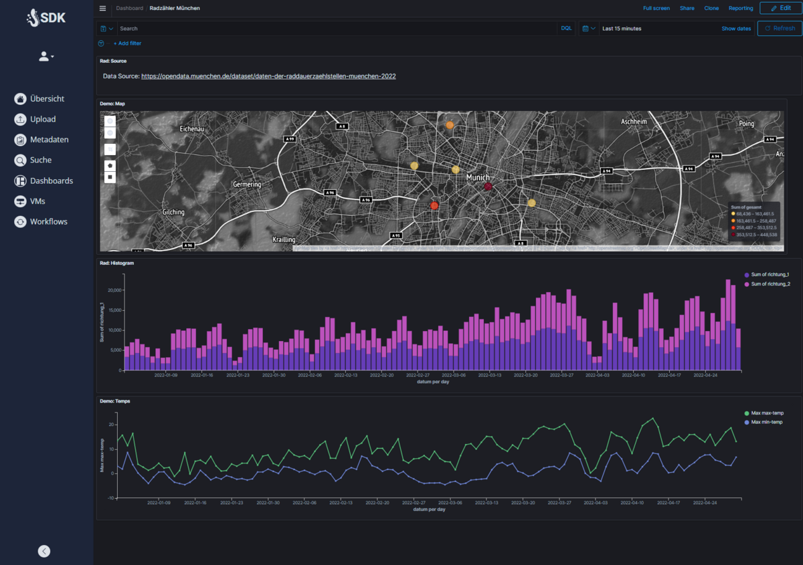
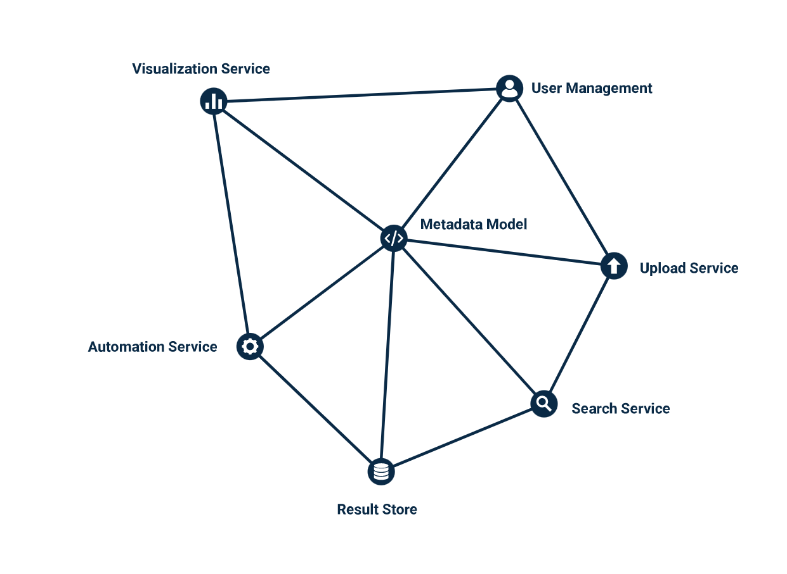

<figure markdown>
  {width="100%"}
  {width="100%"}
  <figcaption>A data platform for everyone</figcaption>
</figure>

# SUPERB DATA KRAKEN

**An automated data platform to capture, process, analyze and present your data**

From your data to your insights in interactive dashboards within minutes. Automation of knowledge extraction through customizable workflows.

SDK is more than just a business intelligence platform as a data platform. Reacquaint yourself with your data and learn how to leverage it further!
 
 
 
<figure markdown>
  {width="800px"}
  <figcaption>SDK at work</figcaption>
</figure>
 
 

# What is Superb Data Kraken?

**Superb Data Kraken (SDK)** is a generalized, multi-functional data platform designed to offer a versatile and rich set of tools to easily handle the most common tasks encountered in data management.

This includes the collection, storage, processing, access management, and analysis of various kinds of data and its metadata. Its fundamental design is a modular microservice architecture composed of loosely coupled components. These can be combined in numerous ways to fulfill the unique needs of each deployment, facilitating the smooth integration of additional modules as required.

Where appropriate, existing open-source solutions are being used. When these are not suitable, custom services have been developed.

# How does it work?

SDK is divided into different components that can be combined according to your preferences. It all starts with data upload. In this process, data is processed through a secure area and transferred to the desired storage location.

During the upload, metadata is captured and processed in a search engine. If needed, this data can be made fully searchable based on content. Automated analysis takes place through workflows, which can be generated and customized as per requirements and references.

The results are then stored in appropriate databases and visualized through interactive dashboards. Users can access the data and the insights derived from it. Of course, access permissions can be managed and personalized by the admin at any time.
 
 
 
<figure markdown>
  {width="800px"}
  <figcaption>SDK at work</figcaption>
</figure>
 
 

# What is beyond your data?

Everyone has the feeling of knowing their data and consequently makes decisions based on this feeling. It would be better to bring the data together and analyze it to turn feelings into facts and let them speak. We're here to help you build the infrastructure for your data.

The goal is to generate knowledge from corporate data using custom processing pipelines. Make decisions based on facts and lead your business into a successful and sustainable future with a data strategy.

# Documentation

[Architecture](architecture/index.md)

[User Guide](user-guide/walk-through.md)

[Operator Guide](operator-manual/prerequesits.md)

# Features

The Superb Data Kraken provides services that enable data to be handled on a generic scale. This includes the following features:

* User-Management
* Role-Based-Access-Control
* Storage
* Metadata-Management
* Search
* Analysis
* Visualization
* Automation

However, Superb Data Kraken can be individually extended according to your requirements. Just reach out to us via :octicons-mail-24: [sdk@efs-techhub.com](mailto:sdk@efs-techhub.com).

# References

[UI](https://github.com/efs-opensource/superb-data-kraken-frontend)

[organizationmanager](https://github.com/EFS-OpenSource/superb-data-kraken-organizationmanager)

[accessmanager](https://github.com/efs-opensource/superb-data-kraken-accessmanager)

[commons](https://github.com/EFS-OpenSource/superb-data-kraken-common)

[logging](https://github.com/EFS-OpenSource/superb-data-kraken-logging)

[avro-models](https://github.com/EFS-OpenSource/superb-data-kraken-storage-schemas)

[metadata-service](https://github.com/EFS-OpenSource/superb-data-kraken-metadata)

[worker](https://github.com/EFS-OpenSource/superb-data-kraken-worker)

[storagemanager](https://github.com/EFS-OpenSource/superb-data-kraken-storagemanager)

[search-service](https://github.com/EFS-OpenSource/superb-data-kraken-search)

[ingest](https://github.com/EFS-OpenSource/superb-data-kraken-ingest)
