# Components

The following diagram provides a brief overview of all the services that make up the Superb Data Kraken.
Services that are self-implemented are marked blue, while open-source solutions are marked grey.

All services and modules run on a Kubernetes cluster.

<figure markdown>
  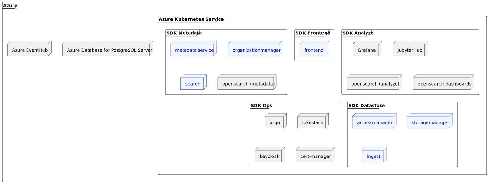
  <figcaption>Tech-Overview</figcaption>
</figure>

At this point, it should be noted that all communication within the kubernetes cluster takes place via http as far as possible (the communication between
frontend and backend is of course ssl-encrypted). The representations in the following chapters contain the respective protocol in square brackets. Some
communication paths are specified more than once ("`[http/https]`"), this is due to the fact that it depends on how the communication is established (
cluster-internal or -external/frontend).

Our Services are implemented with Spring Boot and therefore use Spring MVC to handle REST requests and automatically maps incoming JSON or XML payloads to
predefined Java models using Jackson or JAXB. The mapping is based on the field names and types of the Java model and the payload.

## Organizationmanager

Superb Data Kraken is organized in organizations and spaces, where a space represents a use-case and an organization packages use-cases. The Organizationmanager
is a service of the Superb Data Kraken for the management of organizations and spaces.

On a technical level, an organization corresponds to a Storage Account, whereas a space corresponds to a Container. Each organization has a dedicated "
Container" called 'loadingzone', which serves as an intermediate store for incoming data. After processing, this data will be moved to the main-storage (
target-space) - however this is out of this service's scope (see [ingest](#ingest)).

Each space can handle so-called **capabilities**, which specify which capabilities a space should have:

* STORAGE: dedicated storage-area for data - "suppliers" will be able to upload data
* METADATA: dedicated "measurement"-Index in opensearch for storing metadata to the massdata
* ANALYSIS: provides capabilities in order to generate custom analysis

The organizationmanager calls the defined services to create the complete context infrastructure when creating an organization or space.

<figure markdown>
  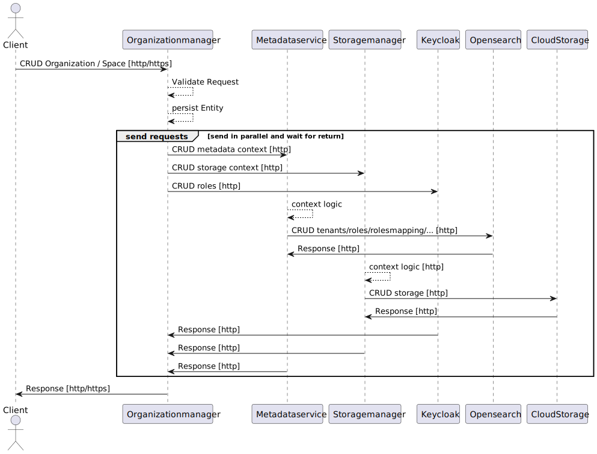
  <figcaption>CRUD organization/space</figcaption>
</figure>

In addition to organizations and spaces, the organizationmanager manages the authorization for these. For information on which roles exist and what they are
authorized for, please refer to the [roles/rights concept](roles-and-rights.md#roles--rights).

<figure markdown>
  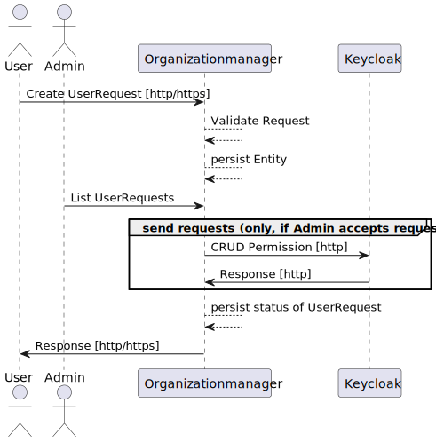
  <figcaption>CRUD UserRequests</figcaption>
</figure>

If users require authorization to a certain organization/space, they can request access ("`UserRequest`") with the desired roles. An administrator (or owner)
can then grant permission or deny it. An administrator (or owner) can also directly grant permissions to users.

<figure markdown>
  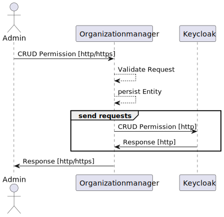
  <figcaption>CRUD Authorization</figcaption>
</figure>

## Metadata

Handles opensearch-structure (roles, rolesmappings, tenants...) and provides endpoints for indexing and handling application-indizes.

When creating an organization, metadata-Service will provide a tenant, as well as dedicated roles and rolesmappings for organization-level roles.

<figure markdown>
  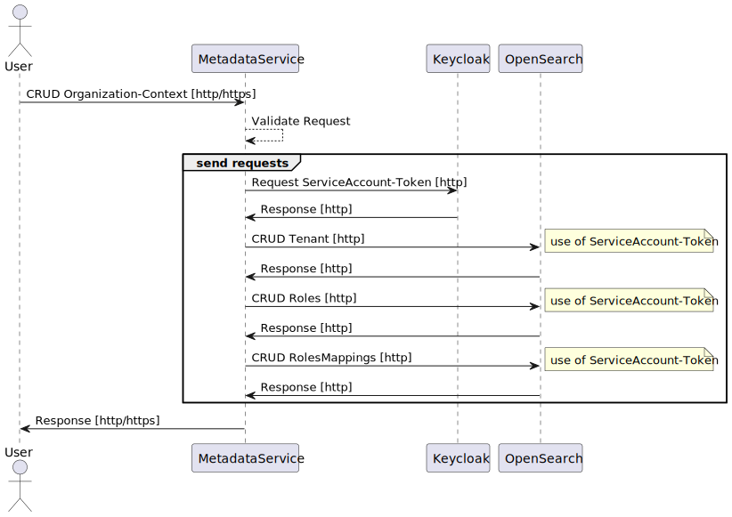
  <figcaption>CRUD organization</figcaption>
</figure>

When creating a space, metadata-Service will provide a tenant, as well as dedicated roles and rolesmappings for space-level roles and an
index `<orga>_<space>_measurements` (including an alias `measurements`).

<figure markdown>
  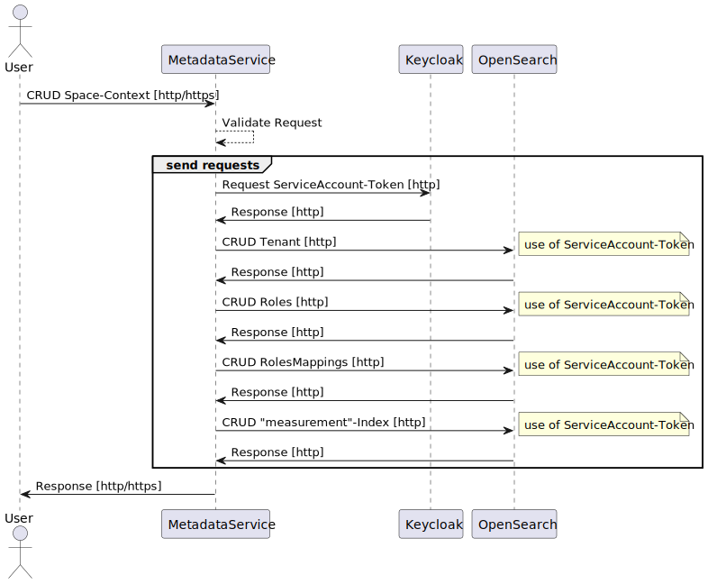
  <figcaption>CRUD space</figcaption>
</figure>

!!! note

    Only trustee can write to index, however also a supplier can create a document! This is due to the fact, that a supplier would be able to overwrite a
    document "empty" and thus delete a document (which would clash with the [roles-/right-concept](roles-and-rights.md#roles--rights)). Therefore a serviceaccount is used.

<figure markdown>
  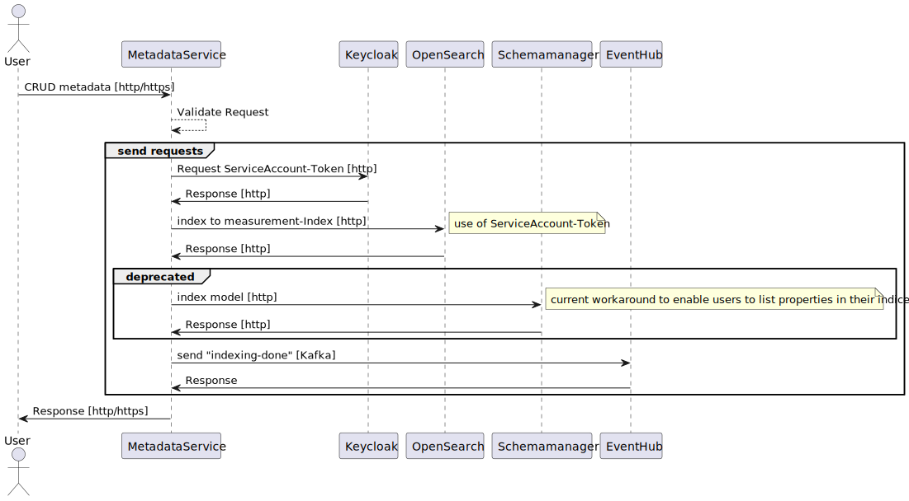
  <figcaption>Index</figcaption>
</figure>

To enable users to create their own analyses, it is possible to create their own analysis indices (application indices) via the metadata service. These analysis
indices are given a name according to the following scheme: `<orga>_<space>_analysis_<a_custom_name>`.

<figure markdown>
  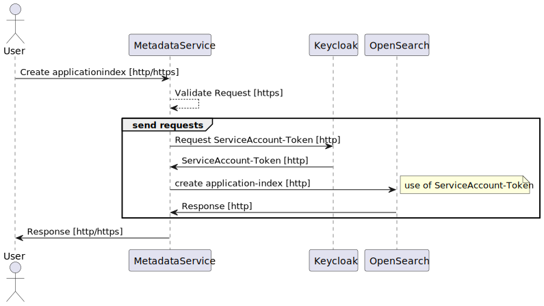
  <figcaption>Application-Index</figcaption>
</figure>

## Storagemanager

Handles storageorganization (in Azure: creates StorageAccount for organization and Container for space; in S3: creates matching prefixes).

Here is, how data is being stored in Superb Data Kraken:

<figure markdown>
  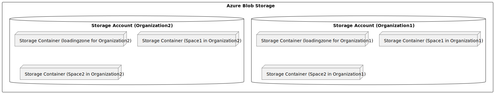
  <figcaption>Storageorganization</figcaption>
</figure>

The reason why there is a dedicated loading zone is that it gives the user the possibility to provide subsequent deliveries to his dataset. Also, this way it
can be ensured that all data that has been indexed is complete and valid (see [Ingest](#ingest)).

The following illustration represent the storagemanagement as it is being handled in Azure.

<figure markdown>
  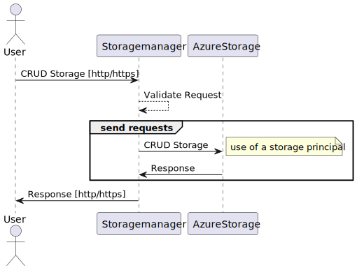{width="450px"}
  <figcaption>CRUD Storage</figcaption>
</figure>

## Accessmanager

Provides endpoints for generating shared access signatures, as well as an endpoint for signalling, that the upload is complete ("commit").

!!! note

    Endpoints for shared access signatures are only available, if Azure is the underlaying storage-provider.

There are four different endpoints for generating according shared access signatures:

* Read
* Upload
* Delete
* Upload-main - this endpoint is only viable for trustees, it enables the user to upload directly to main-storage (passing loadingzone)

<figure markdown>
  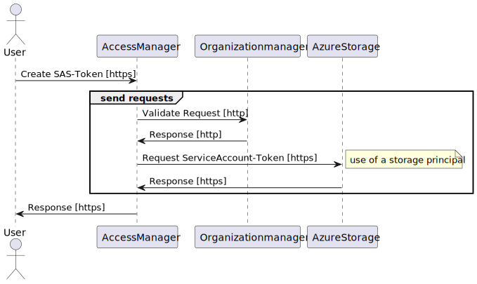{width="550px"}
  <figcaption>Create SAS Token</figcaption>
</figure>

In order for subsequent processes to start without relying on conventions ("meta.json" uploaded last), a dedicated endpoint signals the completion of the
upload. This sends a message to the Azure EventHub ("accessmanager-commit") to which the workflow engine can respond.

<figure markdown>
  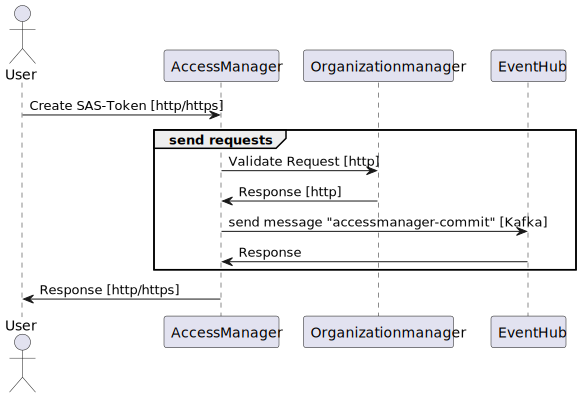{width="450px"}
  <figcaption>Commit</figcaption>
</figure>

!!! note

    For downward-capability accessmanager has some endpoints for managing organizations and spaces. However this functionality is deprecated and will be removed.

## Ingest

The ingest describes how data is fed to the system. It consists of the following steps:

* basic-metadata-handling: if no meta.json is provided and the space is configured so generating of a basic-metadata-set is supported, this handler will do the
  job
* anonymize: currently not implemented
* enrichment: currently not implemented
* validate: currently not implemented
* move-data: moves data from loadingzone to the main-storage
* metadata-index: indexes metadata to `<orga>_<space>_measurements`-index

!!! note

    For simplicity-reasons the following illustration is restricted on azure-specific implementation.

    Although a serviceaccount-token is initially created by the ingest, the index endpoint of the metadata service is invoked with a user-token to take advantage of the request validation of the metadata service (knowing that the metadata-service also switches to a serviceaccount context).

<figure markdown>
  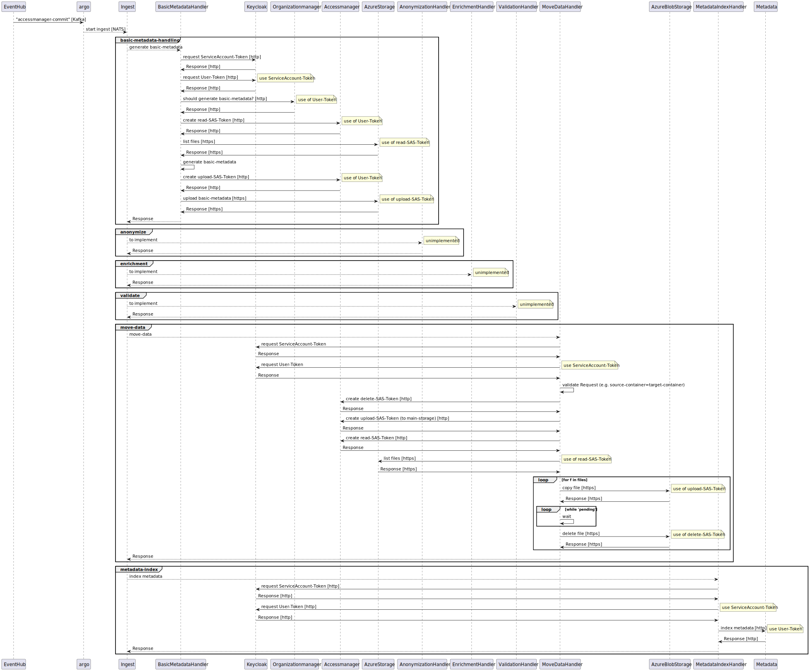
  <figcaption>Ingest</figcaption>
</figure>

!!! note

    There are considerations of defining a custom ingest-process for a space.

## Search

The search-service wraps opensearch in a user-friendly manner. It provides endpoints to enable listing all available properties including the possible
search-operators (e.g. string-properties do not support `<`, `>`). Some properties might be available as result-property however not as criteria (`enabled`),
which is also taken into consideration.

<figure markdown>
  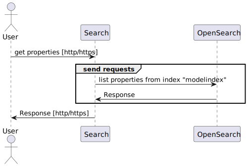{width="450px"}
  <figcaption>Search properties</figcaption>
</figure>

<figure markdown>
  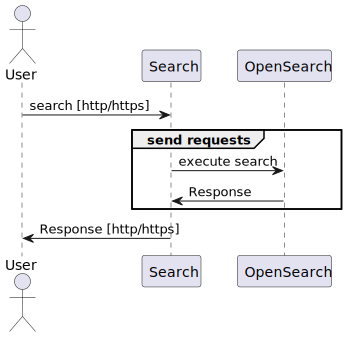{width="350px"}
  <figcaption>Search</figcaption>
</figure>
