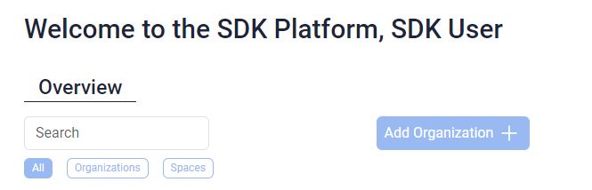
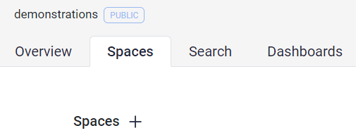
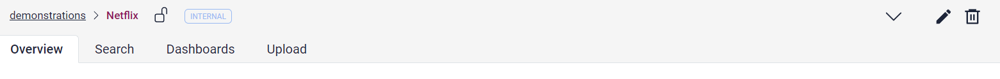
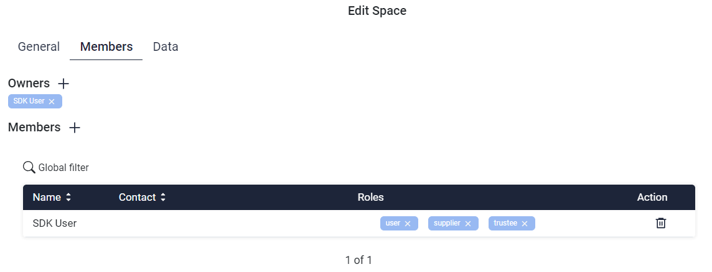
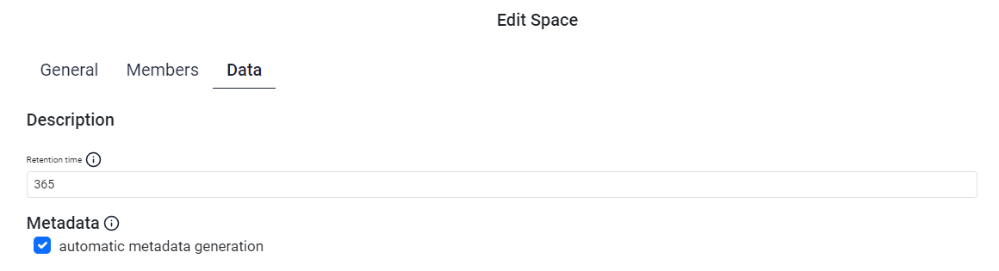

# Admin Guide

The tasks of an administrator in the SDK include the management of organizations and spaces.

## Create/update organization

Only users with the role `org_create_permission` are able to create organizations. If you are the owner
of an Organisation, you are able to create and edit a space in it.

<figure markdown>
  {width="500px"}
  <figcaption>Create organization</figcaption>
</figure>

In the `Members`-tab of the add/edit mode of your organization, you are able to see the members and their roles on your organization. You are also able to add more users and corresponding roles or remove roles from users. The roles you can provide are:

* access: can access data
* admin: representative of the owner, can perform administrative activities
* trustee: can handle Dashboards on an organization-leveled basis

For further information regarding permissions, please consider [roles/rights concept](../architecture/roles-and-rights.md#roles--rights).

## Create/update space

Adding a space can be done via the `+`-sign in the `Spaces`-tab within the organization-view.

<figure markdown>
  {width="400px"}
  <figcaption>Create space</figcaption>
</figure>

Further space-management can be done via the pencil (edit) and trashcan (delete) icons in the upper right corner. You will get the following options when choosing to add or edit a space:

* General
* Members
* Data

<figure markdown>
  
  <figcaption>Admin-View</figcaption>
</figure>

With the `General`-tab you are able to edit the name and the description of your space. You are also able to edit the
confidentiality, status and services ("Capability") of your space. If your space should save your data GDPR conform, you can enable this option here. But be careful, once enabled this option is permanent.

<figure markdown>
  
  <figcaption>Space - General</figcaption>
</figure>

In the `Members`-tab of the create/edit mode of your space, you are able to see the members and their roles on your space. You are
also able to add more users and corresponding roles or remove roles from users. The roles you can provide are:

* trustee: Can create data, edit and delete them
* supplier: Can create data
* user: Can read and download data

For further information regarding permissions, please consider [roles/rights concept](../architecture/roles-and-rights.md#roles--rights).

<figure markdown>
  
  <figcaption>Space - Members</figcaption>
</figure>

The Data tab shows the information about how long your data will be stored and if you want a meta.json automatically created
for your data. This option is handy, if you don't want to provide your own meta.json and a standard one is enough for
your needs.

<figure markdown>
  
  <figcaption>Space - Data</figcaption>
</figure>

!!! note

    Please note that only users who have access to the organization can be added to a space.
