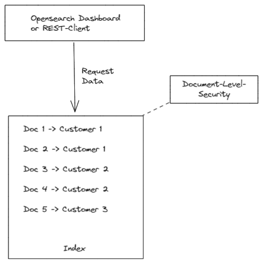
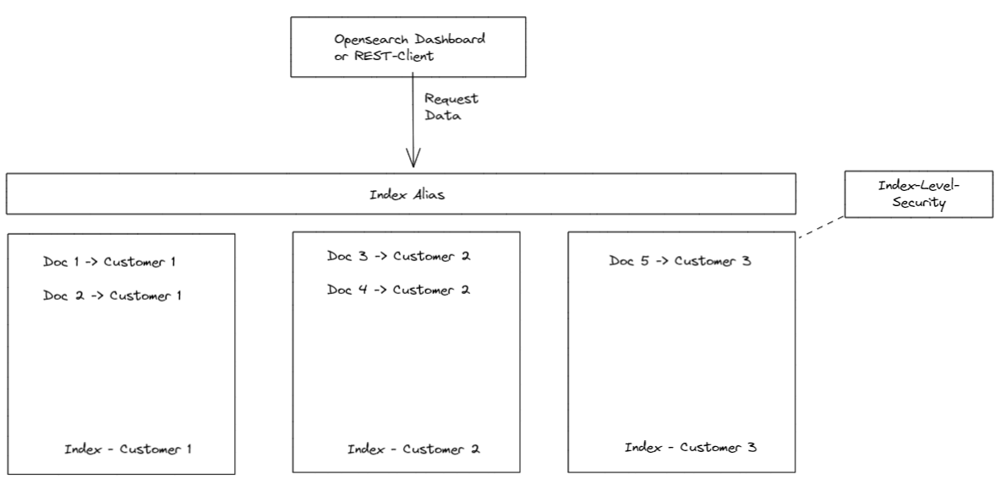

# How-Tos

## How can I download files from the SDK?

### Requirements

Install required packages:

- superb-data-klient: ```pip install superb-data-klient```

### Example

```python
import superbdataklient as sdk

ORGANIZATION = '<orga-name>'
SPACE = '<space-name>'
# all files in dataset but meta.json
REGEX = r'^<root-directory-in-container>\/(?!meta\.json$).*$'

client = sdk.SDKClient()

client.storage_download_files_with_regex(organization=ORGANIZATION, space=SPACE, local_dir='tmp', regex=REGEX)
```

## How can I create an analysis index?

### Requirements

Install required packages:

- superb-data-klient: ```pip install superb-data-klient```

### Example

```python
import superbdataklient as sdk

ORGANIZATION = '<orga-name>'
SPACE = '<space-name>'
ROOT_DIR = '<root-directory-in-container>'

client = sdk.SDKClient(domain='<YOUR_DOMAIN>', realm='<YOUR_REALM>', client_id='<YOUR_CLIENT>', api_version='v1.0')

# Body
mappings = {}

client.application_index_create(CUSTOM_IDX_NAME, ORGANIZATION, SPACE, mappings)
```

## How can document level security be avoided by index level security?


### Requirements

Data for different customers should be stored in Opensearch.
Based on the data a dashboard shall be created.

Customers should only see the data that belongs to them.

### Example

#### Document level security

<figure markdown>
  
  <figcaption>Document level security</figcaption>
</figure>

All documents are stored in one index in Opensearch. Document level security is applied to the index to seperate the data of different customers. This requires an attribute that contains the customer information.

Roles and rights of a user are evaluated on each query to only return the documents that belong to the customer.

Requires configuration of security on different levels. the Superb Data Kraken used Index-Level-Security. This has to be combined with Document-Level-Security and complicates role management.


#### Index level security

This solution is focused on using multiple indices for different customers and combining them with a common Alias.

<figure markdown>
  
  <figcaption>Index level Security</figcaption>
</figure>

The scripts ingesting data to Opensearch use an attribute in the data to decide what index shall be filled.
Data for different customers are written to seperate indices. Because the Superb Data Kraken already uses Index-Level-Security no additional configuration is required.

For querying data from all the indices a common Alias or Openasearch index-pattern is used. So there is no need to perform multiple queries on different indices.
