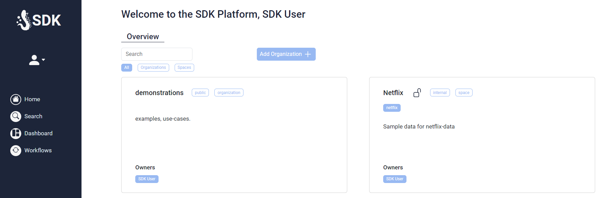

# Quick start

Once you are logged in, you will see the welcome page of the SDK. Here you get an overview of all Organisations and 
Spaces you have the rights to see. You also have the option to only show Organisations or Spaces.

The sidebar provides some global functionality like metadata-search, Dashboards and workflows.

<figure markdown>
  
  <figcaption>Home</figcaption>
</figure>

In general, however, the SDK is designed to be space-driven. For example, the search is also integrated within organizations and spaces, whereby corresponding filters are predefined.
