# Walk Through

This page gives you an overview of a Use Case which contains all the standard features of the SDK.
We will upload a file into the SDK and use its data to create a simple Dashboard to visualize the data.

## Space

A space gives you the option to Upload data into the SDK and also provides you with the option to search
for the uploaded files. You are also able to access your existing Dashboards or create new ones with the data you uploaded.

Once you enter your space you will see the general options tab. Here you see:

* the space name
* the id of the space
* a short description
* the space owner

<figure markdown>
  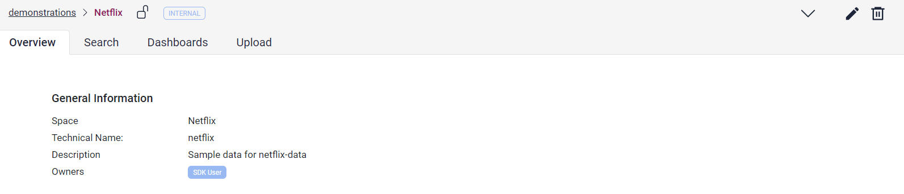
  <figcaption>Space Overview</figcaption>
</figure>

You have the option to upload folders or files into the SDK inside the Upload tab. You need the supplier role to be able 
to upload files in the SDK (more on that later). The Upload to the SDK will take a few seconds and after that you will 
be able to search the files in the Search tab. For this example we uploaded a csv file that we use later to load its data 
into OpenSearch, after we created an index for them.

<figure markdown>
  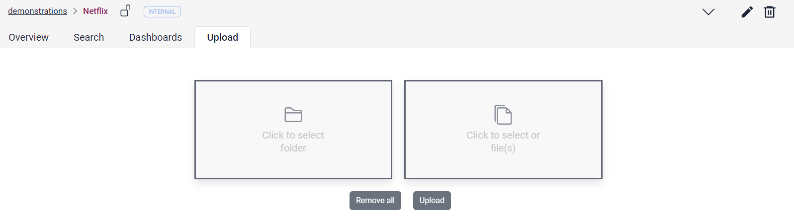
  <figcaption>Upload</figcaption>
</figure>

The Search tab provides you with the option to search for any word which your Upload contained. In this example we 
Uploaded a file called "Netflix Userbase". The search result contains the metadata description of the file.
You are able to access the file itself by clicking on the metadata.

<figure markdown>
  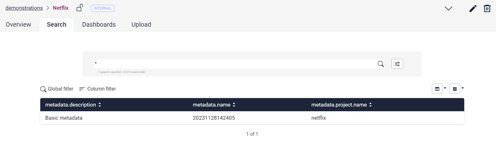
  <figcaption>Space search</figcaption>
</figure>

Here you find the file itself, and you are also able to download it directly from the SDK storage.

<figure markdown>
  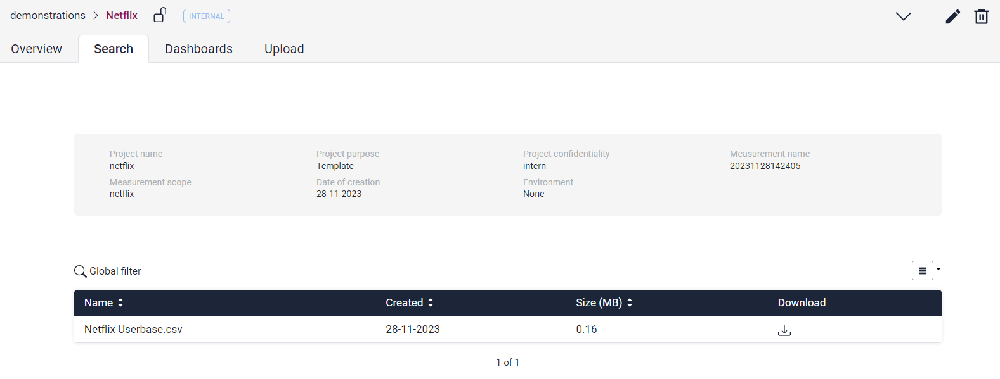
  <figcaption>Space Search Details</figcaption>
</figure>

The Dashboard tab provides you with the option to access your Dashboards. A detailed overview will be given later.

<figure markdown>
  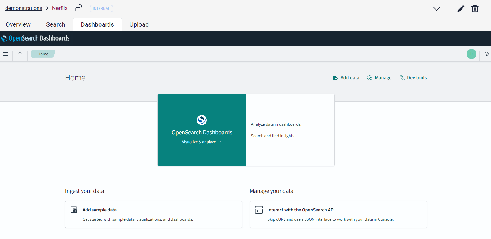
  <figcaption>Space Dashboards</figcaption>
</figure>

## Python-Client

Now that you uploaded a file in your space, you can access the data in your file and save this data in OpenSearch, 
which gets provided by the SDK. You can do that with [Superb Data Klient](https://pypi.org/project/superb-data-klient/).

For any work with SDK you have to establish a connection. This can be done by:

```python
DOMAIN = $(DOMAIN)
REALM = $(REALM)
CLIENT_ID = $(CLIENT_ID)
USERNAME = $(USERNAME)
PASSWORD = $(PASSWORD)
client = sdk.api.SDKClient(domain=DOMAIN, realm=REALM, client_id=CLIENT_ID, username=USERNAME, password=PASSWORD)
```

You can find all versions of the login to the client here in the [documentation](https://pypi.org/project/superb-data-klient/).

After that, you are able to use the following code snippet to download the file from the storage to your local directory:

```python
organization = 'sdkdemonstrations'
space = 'netflix'
files = ['20231128143642/NetflixUserbase.csv']

client.storage_download_files(organization=organization, space=space, files=files, local_dir='tmp')
```

To read the Data from the csv file you downloaded, we need pandas. 

Next you need to create an Index to upload your data to. This can be done using the SDK-API. 
You have to enter the organizationName, the spaceName, a customName, the indexType and the mapping of the data in opensearch (<https://opensearch.org/docs/2.11/field-types/mappings/>).

Example: 

```python
custom_name = 'users'
mappings = {}

client.application_index_create(custom_name, organization, space, mappings)
```

After the successful installation you can use the following small code snippet to upload your Data to the OpenSearch index.

```python
import pandas as pd

# The name of the OpenSearch index the data will be uploaded to
index_name = f'{organization}_{space}_analysis_{custom_name}'

# The File which should be uploaded
df = pd.read_csv('20231128143642/NetflixUserbase.csv')

# Convert the pandas dataframe to a dictionary
documents = df.to_dict('records')

# Upload the dictionary to OpenSearch
client.index_documents(documents, index_name)
```

That is all you have to do for the upload. Now you can access the data in OpenSearch and create visualizations with it.

## Dashboards

Dashboards can be accessed either through your space in the Dashboard tab or through the OpenSearch Dashboard icon on the 
Sidebar.

<figure markdown>
  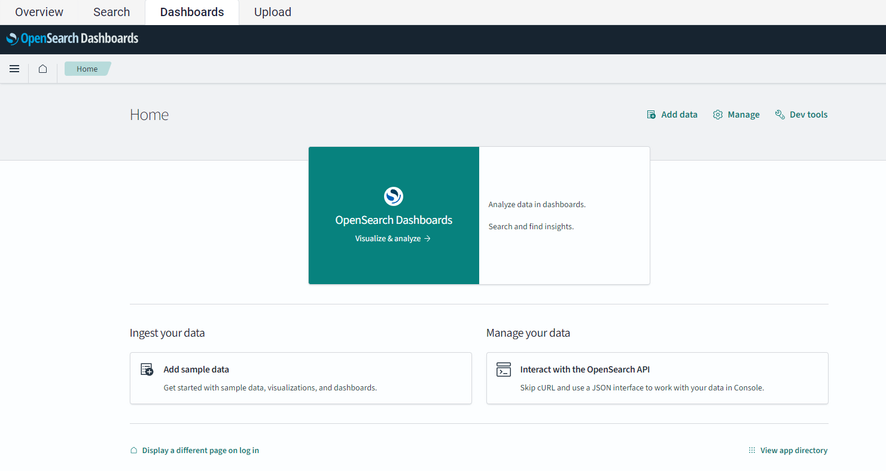
  <figcaption>Dashboard Overview</figcaption>
</figure>

For this Use Case we use OpenSearch to create a Dashboard for the Data we just uploaded. For this we first need to 
create an index pattern. This is done in the `Dashboards Management` which can be found in the `Management` Tools of OpenSearch.

<figure markdown>
  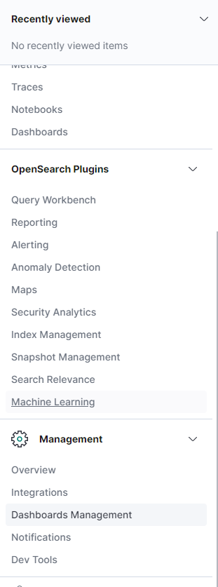{width="250px"}
  <figcaption>Create Index Pattern (1)</figcaption>
</figure>

Next you have to select the option to create an Index Pattern and confirm the next two steps.

<figure markdown>
  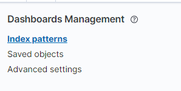{width="250px"}
  <figcaption>Create Index Pattern (2)</figcaption>
</figure>

You now have an empty index in your OpenSearch. To confirm this, you can open the `Dev Tools` of OpenSearch (located in the `Management` section). Here you can send a query to inspect your newly created index.
For this example, it would be:

```
GET  /sdkdemonstrations_netflix_analysis_users/_search
```

After running the python snipped and upload some data, you should get a result similar to this:

<figure markdown>
  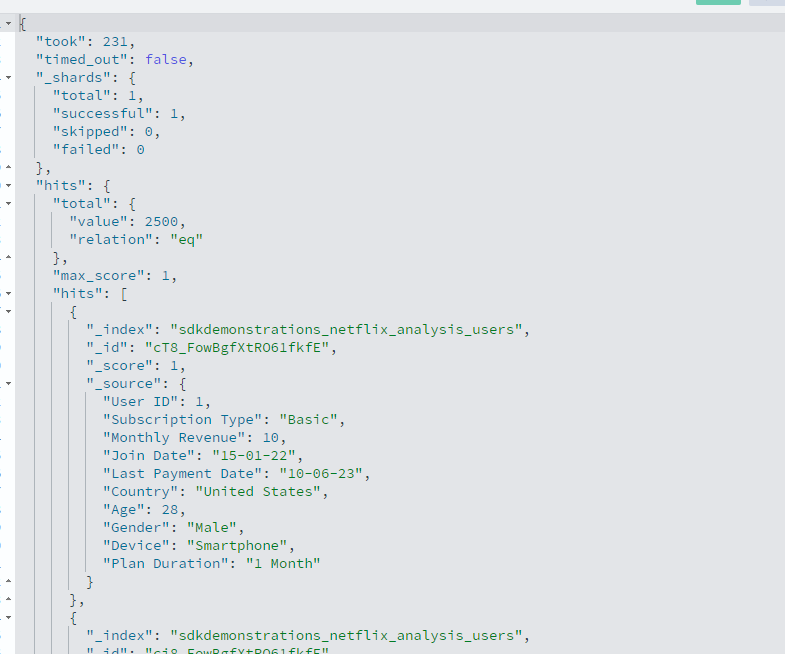
  <figcaption>Index with data</figcaption>
</figure>

With this data, you are now able to use them in visualizations.

This can be done by creating a new Dashboard.

<figure markdown>
  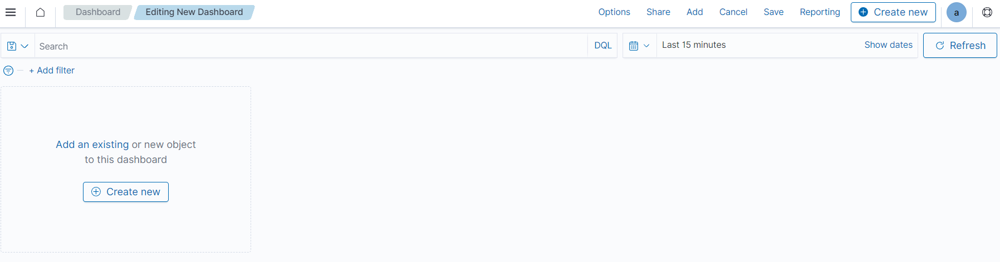
  <figcaption>Create new Dashboard</figcaption>
</figure>

In the next step you have to choose the form of the visualization best suited for your data.

<figure markdown>
  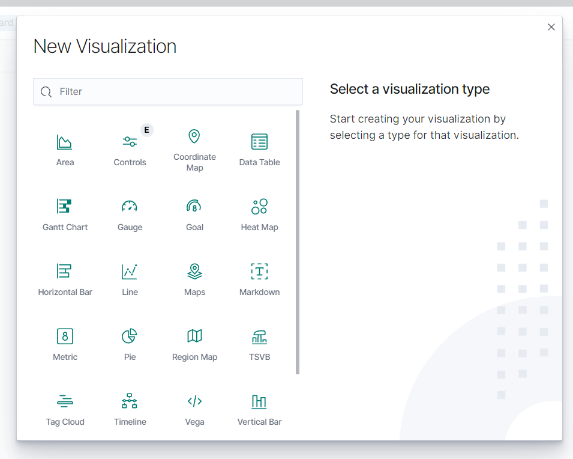{width="700px"}
  <figcaption>Choose visualization</figcaption>
</figure>

Finally, you have to choose the index Pattern you have created.

<figure markdown>
  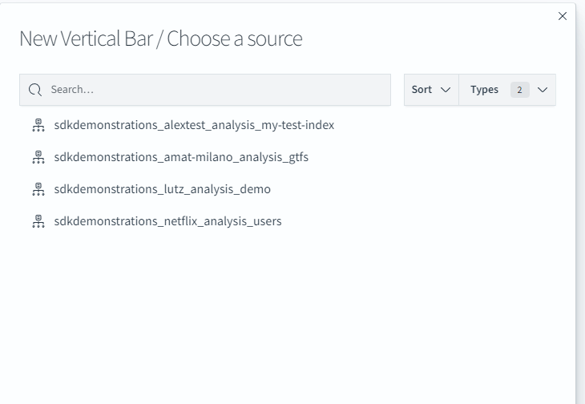{width="700px"}
  <figcaption>Choose Index Pattern</figcaption>
</figure>

Now you are able to visualize your data in a dashboard. In this simple example we took the average age per country and
placed them next to each other to see which country has the oldest and which got the youngest Netflix subscribers.

<figure markdown>
  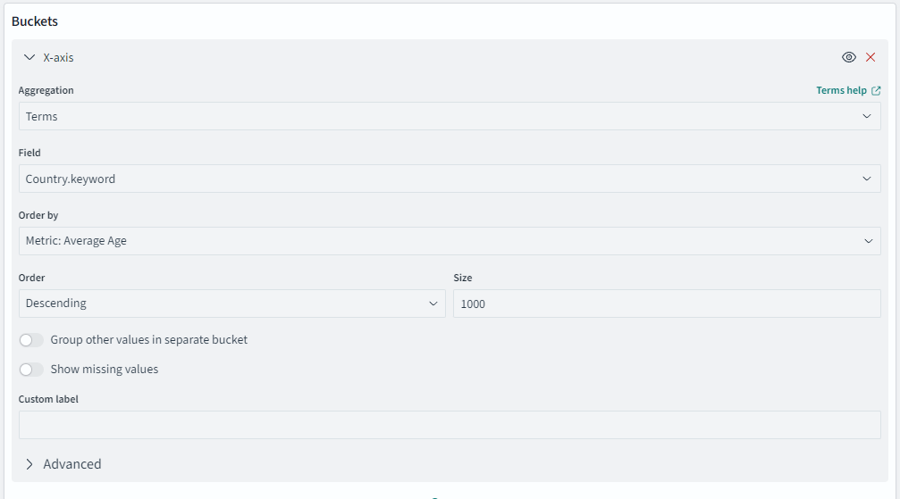
  <figcaption>X-Axis</figcaption>
</figure>

<figure markdown>
  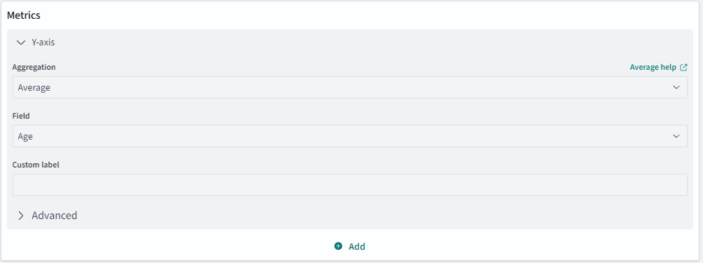
  <figcaption>Y-Axis</figcaption>
</figure>

<figure markdown>
  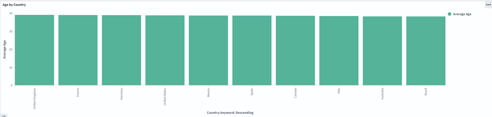
  <figcaption>Example</figcaption>
</figure>

Concluding, if you are creating reports for your dashboard to download, please keep in mind to mark these with the 
corresponding data classification of the SDK space you are working in. To do this, add a header or footer when creating
the report, like here for internal data:

<figure markdown>
  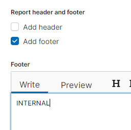
  <figcaption>Data Classification of Report</figcaption>
</figure>